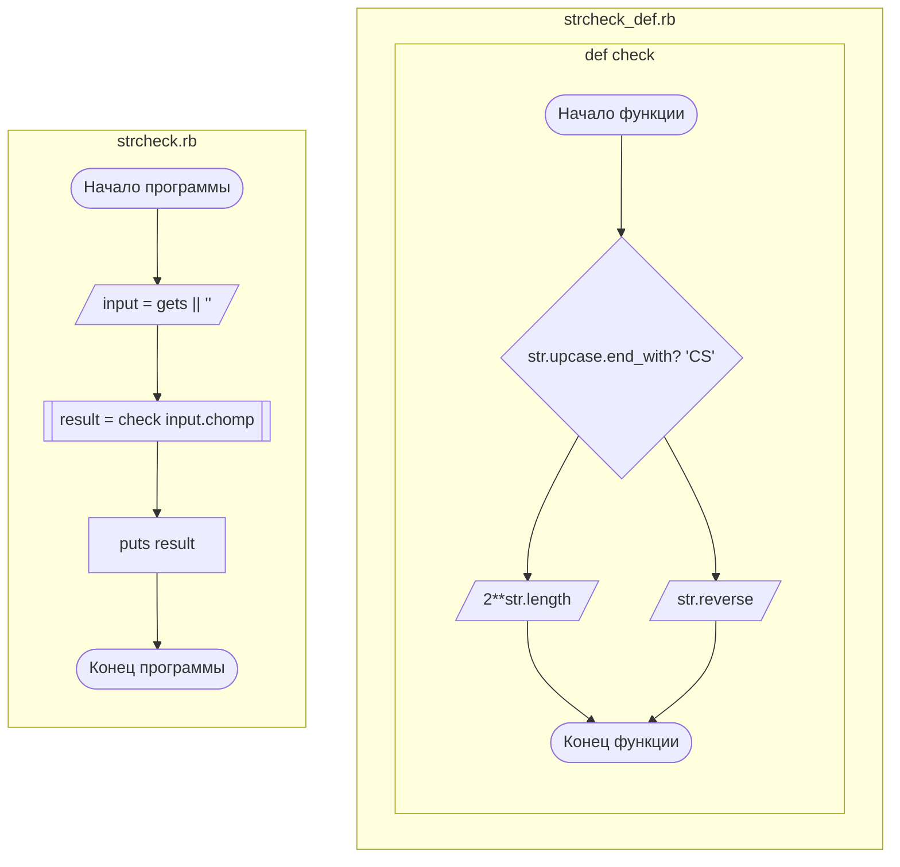
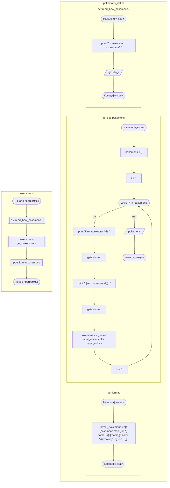

# Диаграммы к заданиям

## Задание 1

### Написать скрипт, который будет принимать слово

```mermaid
flowchart TB
  subgraph strcheck_def.rb
    subgraph def check
      direction TB
      start_check([ Начало функции ]) -->
      cond{ str.upcase.end_with? 'CS' }
      cond --> result1[/ 2**str.length /]
      cond --> result2[/ str.reverse /]
      end_check([ Конец функции ])
      result1 --> end_check
      result2 --> end_check
    end
  end
  subgraph strcheck.rb
    direction TB
    start([ Начало программы ]) -->
    input[/ input = gets || '' /] -->
    check[[ result = check input.chomp ]] -->
    output[ puts result ] -->
    end_([ Конец программы ])
  end
```

## Задание 2

### Написать скрипт, который будет выводить массив покемонов

```mermaid
flowchart TB
  subgraph pokemons_def.rb
    subgraph def format
      direction TB
      start_format([ Начало функции ]) -->
      format_pokemons[" format_pokemons = &quot;[#{pokemons.map { |it| &quot;{ name: '#{it[:name]}', color: '#{it[:color]}' }&quot; }.join ', '}]&quot; "] -->
      end_format([ Конец функции ])
    end
    subgraph def get_pokemons
      direction TB
      start_get_pokemons([ Начало функции ]) -->
      init_pokemons[" pokemons = [] "] -->
      loop_i_set_pokemons[" i = 1 "] -->
      loop_pokemons{{" while i < n_pokemons "}}
      get_name[" print &quot;Имя покемона #{i}: &quot; "] -->
      input_name[ gets.chomp ] -->
      get_color[" print &quot;Цвет покемона #{i}: &quot; "] -->
      input_color[ gets.chomp ] -->
      add_pokemon[" pokemons << { name: input_name, color: input_color } "] -->
      loop_inc_pokemons[ i += 1 ] --> loop_pokemons
      return[/ pokemons /] -->
      end_get_pokemons([ Конец функции ])
      loop_pokemons -- нет --> return
      loop_pokemons -- да --> get_name
    end
    subgraph def read_how_pokemons?
      direction TB
      start_how_pokemons([ Начало функции ]) -->
      output1[ print 'Сколько всего покемонов? ' ] -->
      input_n[/ gets.to_i /] -->
      end_how_pokemons([ Конец функции ])
    end
  end
  subgraph pokemons.rb
    direction TB
    start([ Начало программы ]) -->
    read_how_pokemons[[ n = read_how_pokemons? ]] -->
    get_pokemons[[ pokemons = get_pokemons n ]] -->
    format_output[[ puts format pokemons ]] -->
    end_([ Конец программы ])
  end
```
